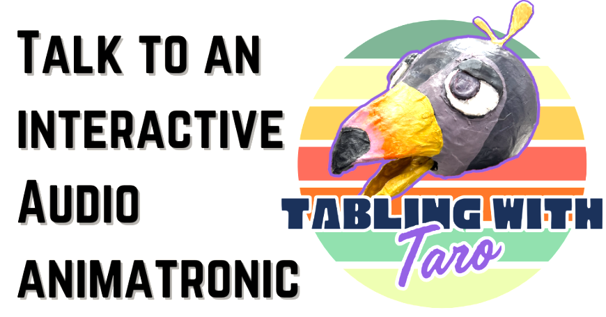

# Interactive Robotic Figure - Taro The Talking Bird

This project is a Raspberry Pi based animatronic control system designed to drive a character named "Taro." It combines real-time audio processing with servo control to create responsive mouth movement synchronized to sound, along with manual controls for head movement and wing flapping.

Watch taro in action:

<a href="https://www.youtube.com/shorts/PKlPhNjFk18">
    
</a>

Taro has been seen around campus talking to students:

<p>
    
    
</p>

Taro concept art:

<p>
    
    
</p>

## Features

* Real-time audio-driven mouth animation using microphone input
* Simultaneous audio playback with optional pitch shifting
* Smooth servo motion with speed limiting and dead zones
* Manual keyboard controls for wings and head movement
* Terminal-based UI for live status and debugging
* Modular C++ design with reusable PCA9685 and AudioMouth components


## Project Structure

```
assets/
  concept_art/        Concept art and diagrams
include/              Public headers
  AudioMouth.h        Audio-driven servo controller
  PCA9685.h           PWM driver interface
legacy/               Older C implementations
src/                  Main C++ source files
  main.cpp            Entry point and UI
  AudioMouth.cpp      Audio processing thread
  PCA9685.cpp         I2C PWM implementation
testing/              Experimental and test code
Makefile              Build configuration
README.md             Project documentation
```


## Hardware Specs

* Raspberry Pi 5 with I2C enabled
* PCA9685 16-channel PWM servo driver
* Servos (tested with MG996R-style PWM ranges)
* USB audio input device (microphone)
* USB audio output device (speaker or sound card)
* External power supply for servos 


## Software

* Linux (Raspberry Pi OS)
* g++ with C++11 
* ALSA development libraries
* I2C enabled

Dependencies:

```bash
sudo apt update
sudo apt install -y build-essential libasound2-dev i2c-tools
```


## Build

From the project root:

```bash
make
```

This produces the main executable defined in the Makefile.


## Run

Run with appropriate permissions to access I2C and audio devices:

```bash
sudo ./tea_animatronic
```

Ensure that the audio device names in `AudioMouth.h` match system:

```cpp
const char* DEVICE_INPUT  = "plughw:CARD=Device,DEV=0";
const char* DEVICE_OUTPUT = "plughw:CARD=UACDemoV10,DEV=0";
```

Use `arecord -l` and `aplay -l` to confirm device names.


## Controls

While running, the program captures keyboard input in the terminal:

* `E`  Flap wings (with cooldown)
* `A`  Turn head left
* `D`  Turn head right
* `Q`  Quit program

The terminal UI updates in real time to show servo positions and audio-driven mouth state.


## Audio Mouth System

The `AudioMouth` class runs in its own thread and performs:

* ALSA audio capture at 48 kHz
* Average amplitude analysis per frame
* Mapping amplitude to servo pulse width
* Smoothing, dead zone filtering, and speed limiting
* Optional pitch shifting via safe decimation

This results in natural-looking mouth movement without jitter.


## PCA9685 Servo Driver

The `PCA9685` class provides:

* Direct I2C register access
* Configurable PWM frequency (default 50 Hz for servos)
* Servo control via angle or pulse width

This implementation avoids external libraries and communicates directly with `/dev/i2c-1`.


## Notes and Warnings

* Do not power servos directly from the Raspberry Pi 5V rail
* Always share ground between the Pi and the servo power supply
* Incorrect I2C wiring or address selection may prevent startup
* Audio latency depends on USB audio hardware
