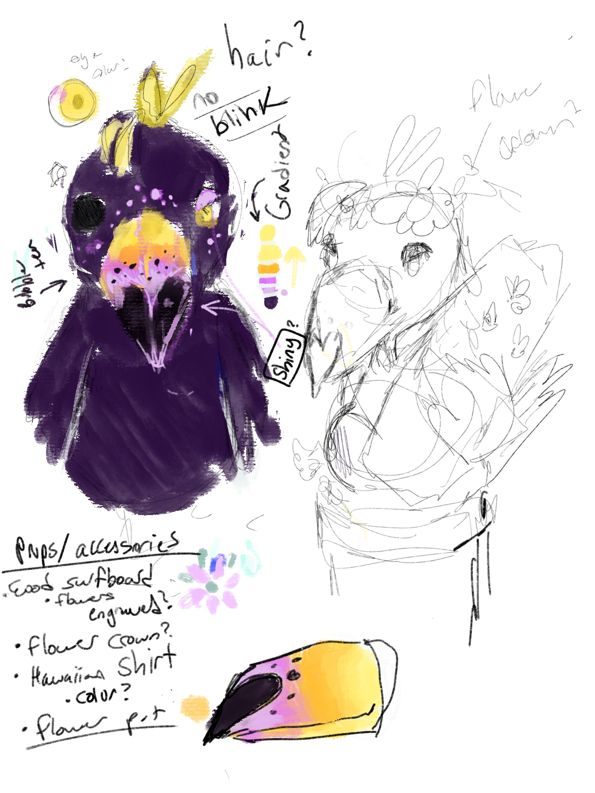

# Project Overview
Watch this robotic figure "Taro" in action: https://www.youtube.com/shorts/PKlPhNjFk18

This project, developed as part of the Themed Entertainment Association (TEA) at UCSD, focuses on designing and building an animatronic figure that enhances themed attractions through innovative storytelling and technology.

## Project Goals

The goal of this project is to design and implement an interactive animatronic character that integrates:

Motion Control: Using servo motor actuators for lifelike movement.

Audio Integration: Synchronizing mouth with real time audio input.

Energy Efficiency & Durability: Ensuring sustainability and long-term reliability in a production setting.

## Documentation

Technical Breakdown

Hardware: Raspberry Pi 5, Arduino, servos, sensors

Software: Advanced Linux Sound Archiecture, Basic C librarys, Aurdino coding platform

├── Body                     # Aurdino Code that controls wings/head movements  
├── mouth                    # C code to run on RPI 5 that snycs audio signal with mouth   
├── assets                   # Non-production related file directories  
    ├── testingScripts           # Proof of concept/test programs for refernce  
    ├── concept_art              # Concept art files  

## Concept Art
