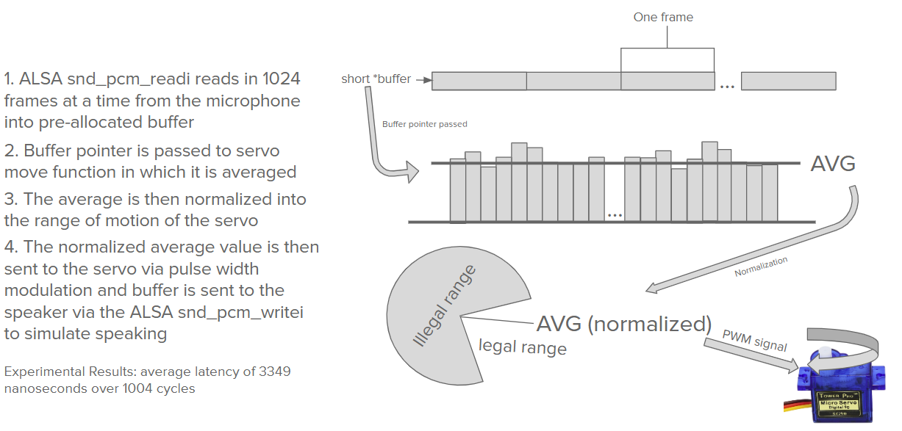

# Project Overview
Watch this robotic figure "Taro" in action: https://www.youtube.com/shorts/PKlPhNjFk18

This project, developed as part of the Themed Entertainment Association (TEA) at UCSD, focuses on designing and building an animatronic figure that enhances themed attractions through innovative storytelling and technology.

## Documentation

Technical Breakdown

Hardware: Raspberry Pi 5, Arduino, servos, sensors

Software: Advanced Linux Sound Archiecture, Basic C librarys, Aurdino coding platform

```
├── assets              # Non-production related files
│   ├── concept_art     # Concept art for animatronic/robotic figure   
│   └── testingScripts  # Testing scripts for different parts of the figure
├── loudmouth.c         # C code that controls mouth movement on RPI 5
├── main.ino            # Aurdino cod that drives the wings and head movements
├── Makefile            # Compiles the C file 
└── README.md           # What your currently reading!
```

### Mouth code [taromouth.c] visualized


## Concept Art

